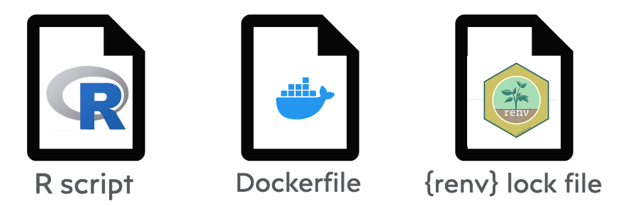

```{r setup, include=FALSE}
knitr::opts_chunk$set(echo = FALSE)
```

# Geocoding and Geomarker Assessment

- The role of the environment in health has been known for decades, but the data and tools needed to characterize the relationship at a population level have only recently become available.

- **Geocoding**: Converting a string of text into latitude and longitude coordinates

<center>
*place (+ time) → estimated past "exposures"*
</center>

- **Geomarker**: Similar to biomarkers in precision health and defined as any objective, contextual, or geographic measure that influences or predicts the incidence of outcome or disease

    - community deprivation, crime, cultural isolation indices 
    - census, surveys
    - airborne pollutants
    - landcover classification (Figure 1a), greenspace (Figure 1b)
    - access to healthcare (Figure 1c), healthy food, pharmacies, transportation
    - noise, heat, walkability, parks, proximity to roads/traffic (Figure 1d)

```{r fig1, out.width='80%', fig.cap='Geomarker Examples', fig.align='center'}

```

# Privacy and Reproducibility in Health Studies

- Confidentiality of patients and research subjects must be safeguarded (HIPAA privacy rule, HITECH Act of 2009, and Federal Policy for the Protection of Human Subjects)
- Address (and equivalent geocode) is considered Protected Health Information (PHI)
- Presents challenge when integrating geocoding and geomarkers into research studies and clinical applications
    - Most existing IRB protocols and institutional data use agreements prevent transmission of PHI over the internet (e.g. Google, ArcGIS Online, Texas A&M Geocoder)
    - IRB approvals are lengthy and may not even be possible depending on original consent forms
    - Different methods introduces differential error, resulting in biased associations between geomarkers and health outcomes
    - Commercial options are cost prohibitive and are not designed for operations at scale
    - Closed source geocoder prevents transparency and reproducibility

# DeGAUSS

<br>
<center>
**DE**centralized **G**eomarker **A**ssessment for m**U**lti **S**ite **S**tudies
</center>

```{r fig2, out.width='100%', fig.cap='DeGAUSS Workflow'}

```

- Decentralized approach for geocoding and deriving community and individual level environmental characteristics
- Reproducible and standardized geomarker assessment while preserving the privacy of PHI (never exposed to the internet)
- Software based on a container framework that reads and writes CSV files
- Does not require extensive computational resources or extensive knowledge of command line and/or geospatial computing

| **image** |  **description** |
|-----------:|:------------------|
[`degauss/geocoder`](https://degauss.org/geocoder) | batch geocoding |
[`degauss/cchmc_batch_geocoder`](https://degauss.org/cchmc_batch_geocoder) | geocoding, census tract, deprivation index |  
[`degauss/census_block_group`](https://degauss.org/census_block_group) | census block group FIPS |
[`degauss/roads`](https://degauss.org/roads) | proximity and length of major roads |
[`degauss/greenspace`](https://degauss.org/greenspace) | enhanced vegetation index |
[`degauss/geocoder_slim`](https://degauss.org/geocoder_slim) | API returning geocoded text string as JSON |
[`degauss/PEPR_drivetime`](https://degauss.org/PEPR_drivetime) | distance and drive time to clinical care sites |
[`degauss/schwartz_grid_lookup`](https://degauss.org/schwartz_grid_lookup) | schwartz grid for spatiotemporal pollutant models |
[`degauss/schwartz`](https://degauss.org/schwartz) | daily PM2.5, NO2, and O3 concentrations |

# Applications

- DeGAUSS is open source and can be customized for applications specific to different studies
- Limited use agreement or deidentified dataset (other healthcare systems, government agencies)
- Sharing exposure assessment models
- Electronic health record and registry integration

### Development

The setup shown below utilizes Docker and `R` to build DeGAUSS software that is self-contained and does not require passing PHI to the internet, but a similar workflow can be employed using other programming languages and containerization software.

```{r fig4, out.width='40%', fig.cap='DeGAUSS Development', fig.align='center'}

```

- `R` script: code that performs geospatial task
- `Dockerfile`: instructions to set up the container including installation of operating system, system dependencies, required geospatial datasets, R, and required R packages
- `renv` lockfile: documents sources and versions of R packages required to run the R code

# Summary

<br>
DeGAUSS is a secure, decentralized, and reproducible approach to solving geospatial privacy issues in multi-site studies, but it also excels as a vehicle for making spatiotemporal exposure assessment prediction models findable, accessible, interoperable, and reusable (FAIR).
<br>

# Contact

 

- Free and open source development
- Ongoing user [feedback](https://redcap.link/gvhbxfjd)

 [https://degauss.org](https://degauss.org)

  \@degauss-org

 erika.rasnick@cchmc.org

  \@erika_rasnick
<br>
<br>

# References

<br>
Cole Brokamp, Chris Wolfe, Todd Lingren, John Harley, Patrick Ryan. Decentralized and Reproducible Geocoding and Characterization of Community and Environmental Exposures for Multi-Site Studies. *Journal of American Medical Informatics Association*. 25(3). 309-314. 2018. [Download.](https://colebrokamp-website.s3.amazonaws.com/publications/Brokamp_JAMIA_2017.pdf)

Cole Brokamp. DeGAUSS: Decentralized Geomarker Assessment for Multi-Site Studies. *Journal of Open Source Software*. 2018. [Download.](https://colebrokamp-website.s3.amazonaws.com/publications/Brokamp_JOSS_2018.pdf)
